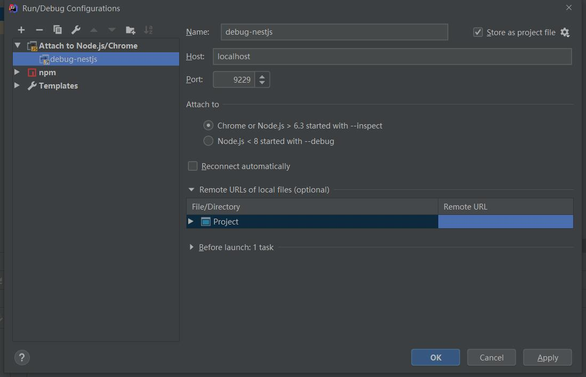

### debug in IDEA
create a node attach script,and run before npm/yarn script(start:debug)   
   

### directory

* src/business-mo business-modules
* src/common-mo,common modules,general global
* src/dto database-entities
* src/domain domain-bean
* src/utils
* src/middleware  